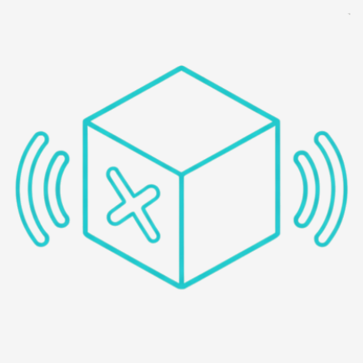
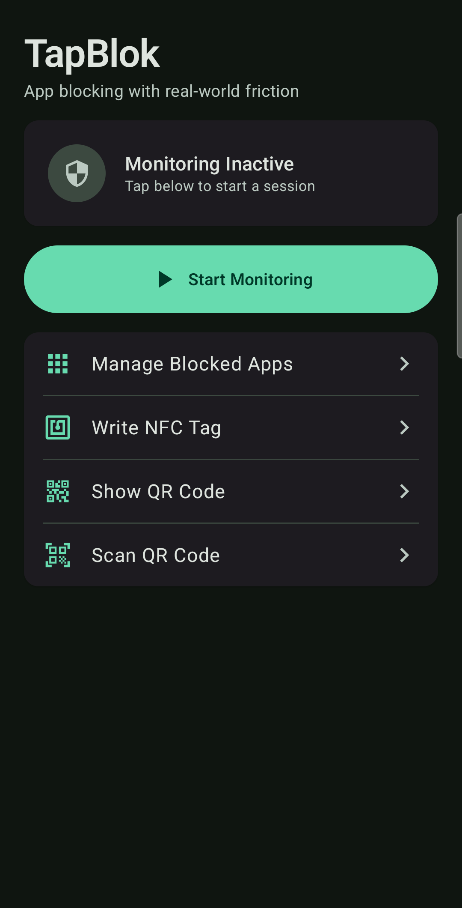
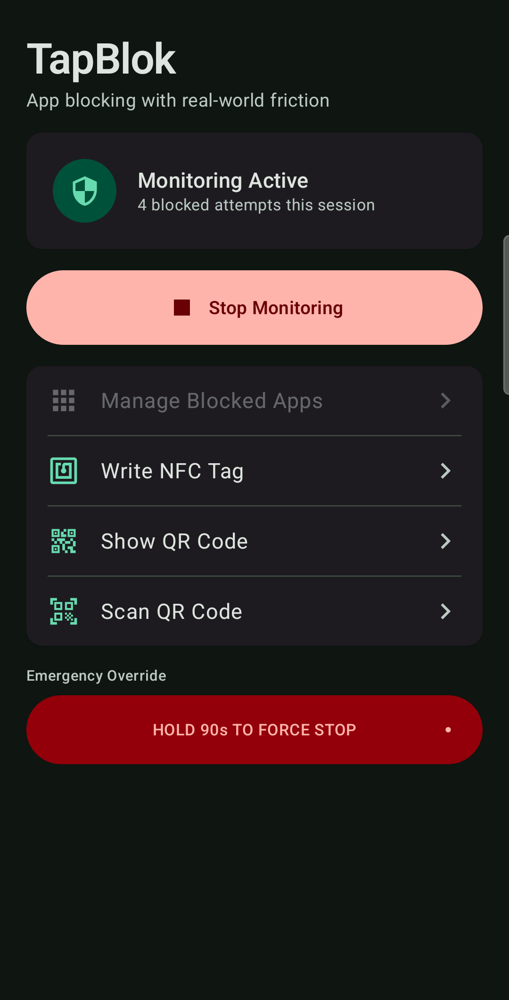
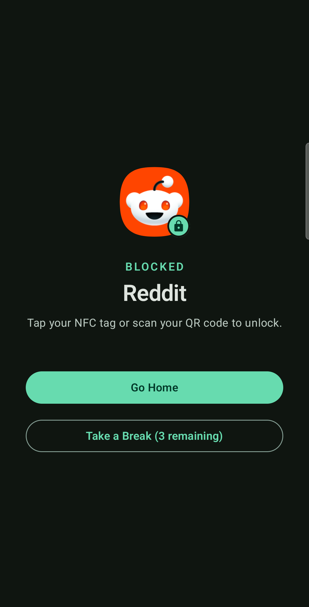
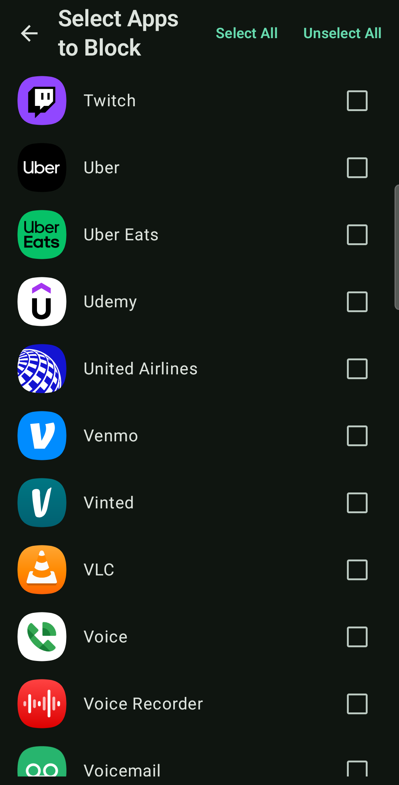
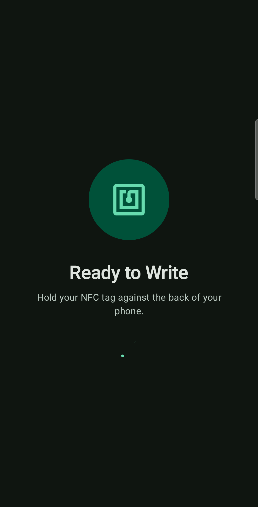
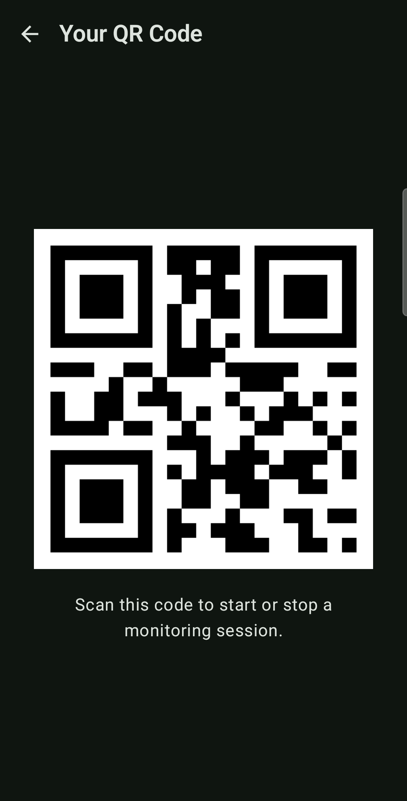

  

<h1 align="center">TapBlok</h1>

  <strong>Block distracting apps — the physical way.</strong>

  TapBlok makes you earn your screen time back. Start a focus session and your chosen apps are locked — the only way out is scanning an NFC tag or QR code you've placed somewhere inconvenient. No digital bypass. No "just this once."

Android 7.0+ &nbsp;·&nbsp; Apache 2.0 &nbsp;·&nbsp; Free, no subscription

---

## 🛠️ Fork Updates

The exit logic has been overhauled to provide dynamic resistance based on your focus goals:

- **Mode-Aware Exits**: 
    - **Chill Mode**: (Same as original app) Any valid NFC/QR scan toggles monitoring immediately, even from the block screen.
    - **Strict Mode**: Scanning on a block screen grants a **temporary timed unlock for the single app**. Stopping requires scanning while TapBlok is in the foreground.
- **Improved Feedback**: A silent notification will appear to tell you how much time you have left if you are in strict mode.
- **Unified Payloads**: Both `TAPBLOK_TOGGLE` and `TAPBLOK_UNLOCK:<duration>` are now supported.

---

  
  &nbsp;&nbsp;
  
  &nbsp;&nbsp;
  

  
  &nbsp;&nbsp;
  
  &nbsp;&nbsp;
  

---

## ✨ Features

- **🏷️ NFC Tag Support** — Write TapBlok's token to any NTAG213 tag (under $1 each). Tap to toggle a session.
- **📷 QR Code Support** — Generate a QR code in-app and print it. Hide it somewhere that requires real effort to reach.
- **🔒 Block Any App** — Choose any launchable app on your device. Critical system apps (dialer, settings, launcher) are permanently excluded so you can't lock yourself out.
- **☕ Smart Breaks** — Take up to 3 five-minute breaks per session without ending it.
- **🔁 Boot Persistence** — If your device restarts mid-session, TapBlok picks right back up.
- **🚨 Emergency Override** — Lost your tag? A 90-s[README.md](README.md)econd hold gives you a last resort exit — slow enough to stop impulse bypassing.
- **📊 Attempt Counter** — See how many times you tried to open a blocked app. Accountability you can't ignore.
- **⚡ App Shortcut** — Long-press the TapBlok icon to start a session instantly.
- **🆓 Completely Free** — No subscription, no in-app purchases, no tracking, no cloud.

---

## 🛡️ Modes of Operation

TapBlok now offers two modes to match your focus needs:

### Chill Mode (Default)
Any valid scan (NFC or QR) immediately toggles the monitoring state. If you're on a block screen, scanning your tag will end the session instantly. Best for those who want a simple physical switch for their focus.

### Strict Mode
Designed for maximum friction and discipline:
- **Foreground Enforcement**: Monitoring can only be stopped by scanning your tag while the TapBlok app is open in the foreground. Background scans will trigger a "Strict Mode Active" notification.
- **Timed Unlocks**: Scanning a tag from a block screen won't end the session; instead, it grants a temporary unlock (default 5 minutes) for that specific app.
- **Dynamic Feedback**: The persistent notification only shows active unlock timers and hides itself when idle to reduce clutter.

---

## 🚀 Getting Started
**Note on Installation**: The APKs on my fork will not be signed. You will get a scary popup saying "Unrecognised developer"! If you don't trust this, you will have to build the app from source.

1. **Install** — Download the APK from the [latest release](https://github.com/cajdata/TapBlok/releases/latest) and install it (you will likely need to click something like "more details > install anyway".
2. **Grant permissions** — Usage Access and Display Over Other Apps are required, notifications are suggested. TapBlok will prompt you. 
3. **Pick your apps** — Tap "Manage Blocked Apps" and select the apps you want to block.
4. **Set up your unlock method** — Write an NFC tag in-app, or generate a QR code and print it.
5. **Start a session** — Tap "Start Monitoring" and put the tag somewhere out of arm's reach.

### NFC Tags

Any NDEF-compatible NFC tag works. Personally, I use and recommend these [NTAG215 NFC sticker tags (black, adhesive)](https://amzn.to/418E7nb) — they're low-profile, stick well, and the black color blends in wherever you put them. A pack of 10 is a few dollars.

1. Tap **Write NFC Tag** in the app
2. Hold your tag to the back of your phone
3. Done — place the tag somewhere that adds friction (not next to your phone)

> As an Amazon Associate I earn from qualifying purchases.

### QR Code

1. Tap **Show QR Code** in the app
2. Screenshot or print it
3. Put it somewhere that requires getting up — another room, your wallet, your desk drawer

---

## 🏗️ Architecture

Built entirely in Kotlin using modern Android development practices.

| Component | Purpose |
|---|---|
| `AppMonitoringService` | Foreground service — polls the foreground app every second, launches `BlockingActivity` on a match |
| `BlockingActivity` | Full-screen overlay shown when a blocked app is detected |
| `AppSelectionActivity` | Lets users pick which apps to block |
| `NfcHandlerActivity` | Toggles the service when a TapBlok NFC tag is scanned |
| `NfcWriteActivity` | Writes TapBlok's NDEF record to an NFC tag |
| `QrCodeActivity` | Generates and displays the unlock QR code |
| `BootCompletedReceiver` | Restarts the service after device reboot if a session was active |

**Stack:** Jetpack Compose · Material 3 · Room · Kotlin Coroutines · ZXing · Coil

---

## 🤝 Contributing

Contributions are welcome.

1. Fork the repo
2. Create a feature branch
3. Commit your changes
4. Open a Pull Request

---

## 📄 License

Apache 2.0 — see [LICENSE](LICENSE) for details.

---

  Made in Denver, CO 🏔️

